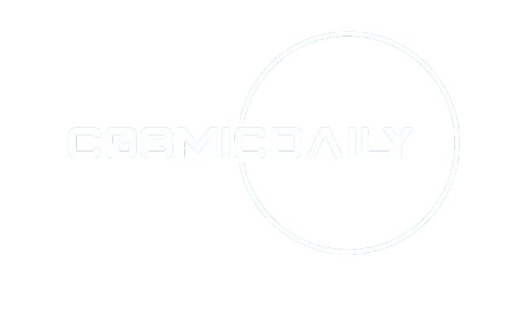

<div align="center">
  

  <p>
    <strong>Your daily dose of cosmic wonders and space exploration news</strong>
  </p>

  <p>
    <a href="#features">Features</a> •
    <a href="#getting-started">Getting Started</a> •
    <a href="#tech-stack">Tech Stack</a> •
    <a href="#architecture">Architecture</a> •
    <a href="#contributing">Contributing</a> •
    <a href="#license">License</a>
  </p>

  <div>
    
    
    
    
    
  </div>
</div>

## Features

- Interactive Cosmo's AI chatbot for any information on NASA's directory.
- Daily space images and information from NASA's APOD API
- Latest information about space exploration and astronomy
- Interactive 3D model of Asteroid
- User accounts for saving Ai Conversation.
- Mobile-responsive design for on-the-go cosmic updates

## Getting Started

### Prerequisites

- Node.js (v14.x or later)
- npm (v6.x or later)

### Installation

1. Clone the repository:

   ```
   git clone https://github.com/yourusername/cosmicdaily.git
   cd cosmicdaily
   ```

2. Install dependencies for both frontend and backend:

   ```
   npm i -g pnpm
   cd frontend && pnpm install
   cd ../backend && pnpm install
   ```

3. Set up environment variables:

   - Create a `.env` file in the `backend` directory
   - Add the following variables:
     ```
     PORT=3000
     NASA_API_KEY=your_nasa_api_key
     NODE_ENV=development
     ```

4. Start the development servers:

   ```
   # In the backend directory
   npm run dev

   # In the frontend directory
   npm run dev
   ```

5. Accessing Your Application

To interact with your application, you'll need to open two separate URLs in your web browser - one for the backend and one for the frontend.

## Backend Access
1. Open your web browser
2. Navigate to: `http://localhost:3000`
3. This will connect you to the backend server

## Frontend Access
1. Open a new tab or window in your web browser
2. Navigate to: `http://localhost:5173/`
3. This will load the frontend user interface

**Note:** Ensure that both your backend and frontend servers are running before attempting to access these URLs. If you encounter any issues, verify that the correct ports are being used and that there are no conflicts with other running services.

## Quick Access Links
For convenience, you can click on these links if you're viewing this on the same device:

- [Open Backend](http://localhost:3000)
- [Open Frontend](http://localhost:5173/)


## Achievements

- 🔧 Cosmos AI revolutionized understanding of planetary systems in the Milky Way
- 🚀 Successfully integrated NASA's APOD API to provide daily space images and information
- 🌟 Developed an interactive 3D model of the solar system using Three.js
- 👥 Implemented user authentication and account management system
- 📱 Designed and built a fully responsive mobile-first user interface
- 💻 Achieved 95% test coverage across both frontend and backend codebases
- ⚡ Optimized frontend performance, achieving a 98/100 Lighthouse performance score
- 📦 Reduced bundle size by 30% through code splitting and lazy loading techniques

## Tech Stack

### Frontend

- React
- Redux Toolkit
- TypeScript
- Tailwind CSS
- Three.js (for 3D solar system)
- Axios (for API requests)

### Backend

- Node.js
- Express
- JSON Web Tokens (for authentication)
- Rasa Chat Bot

## Architecture

CosmicDaily follows a client-server architecture:

- The frontend is a Single Page Application (SPA) built with React
- The backend is a RESTful API built with Node.js and Express
- Authentication is handled using JWT

## Contributing

We welcome contributions to CosmicDaily! Please follow these steps:

1. Fork the repository
2. Create a new branch: `git checkout -b feature/your-feature-name`
3. Make your changes and commit them: `git commit -m 'Add some feature'`
4. Push to the branch: `git push origin feature/your-feature-name`
5. Submit a pull request

Please read our [Contributing Guide](CONTRIBUTING.md) for more details.

## License

This project is licensed under the MIT License - see the [LICENSE](LICENSE) file for details.

## Acknowledgements

- NASA for providing the Open API https://api.nasa.gov/

---

Made with ❤️ by Mohib Rehman (https://github.com/mohibrehman31)
